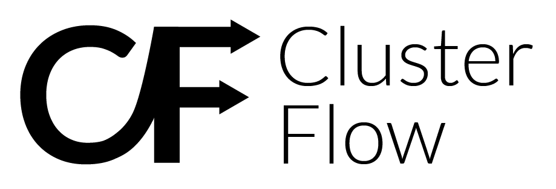

# 

> Cluster Flow is a pipelining tool to automate and standardise bioinformatics analyses on high-performance cluster environments. It is designed to be easy to use, quick to set up and flexible to configure.

[](https://travis-ci.org/ewels/clusterflow)

## Documentation
For Cluster Flow documentation with information and examples, see: **[http://clusterflow.io](http://clusterflow.io)**

## Download
You can find stable versions to download on the [releases page](https://github.com/ewels/clusterflow/releases).

You can get the development version of the code by cloning this repository:
```
git clone https://github.com/ewels/clusterflow.git
```
Alternatively, you can download a [.zip file](https://github.com/ewels/clusterflow/archive/master.zip)

## Credits

Cluster Flow was written by [Phil Ewels](http://phil.ewels.co.uk) whilst working in the
[Babraham Bioinformatics](http://www.bioinformatics.babraham.ac.uk/) group in Cambridge, UK.
He now maintains it whilst working at the [Science for Life Laboratory](http://www.scilifelab.se/) in Stockholm, Sweden.

Cluster Flow has also had contributions from [@stu2](https://github.com/stu2), [@orzechoj](https://github.com/orzechoj),
[@s-andrews](https://github.com/s-andrews) and [@FelixKrueger](https://github.com/FelixKrueger), amongst others.

## License
Cluster Flow is released with a GPL v3 licence. Cluster Flow is free software: you can redistribute it and/or modify it
under the terms of the GNU General Public License as published by the Free Software Foundation, either version 3 of the
License, or (at your option) any later version. For more information, see the licence that comes bundled with Cluster Flow.
